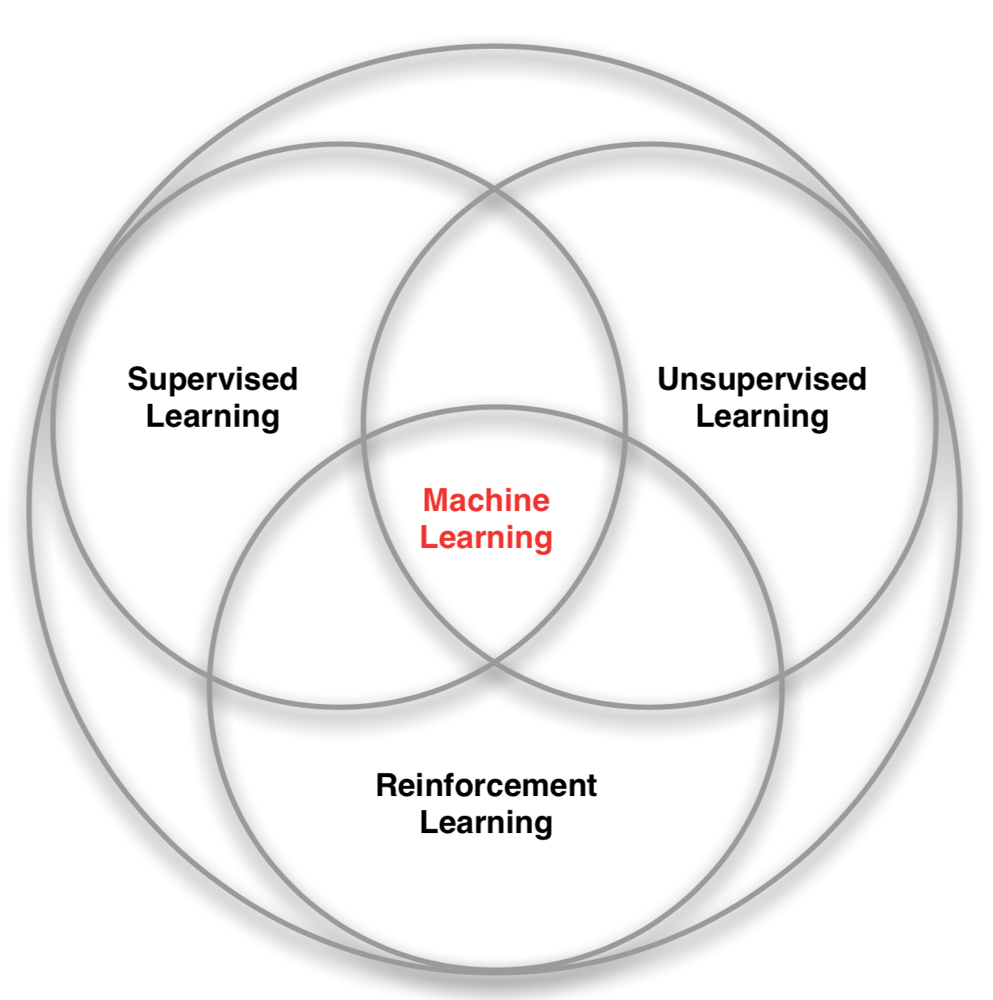
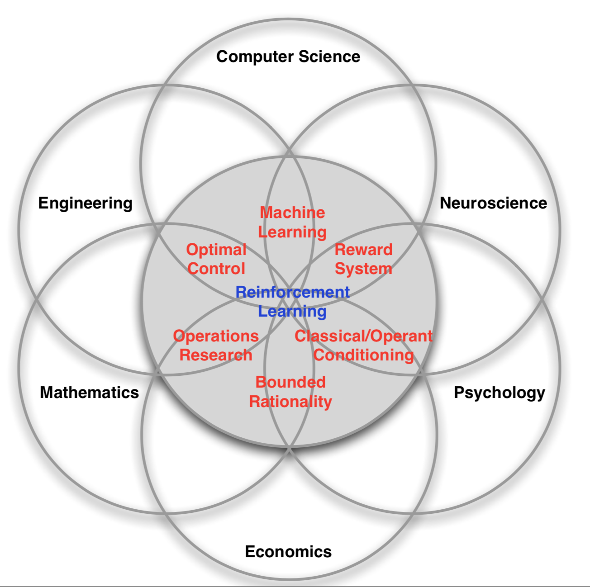

> 本系列基于d.silver的强化学习课程，及Richard S. Sutton的教材《Reinforcement Learning: An Introduction》，整理并汇总其中的核心内容，并做一定的注解，复写课程/书中的主要样例代码。

## 参考资料

1. **主要教材**
   - [《Reinforcement Learning: An Introduction》](http://incompleteideas.net/book/the-book.html)
   - 主页：[Richard S. Sutton](http://incompleteideas.net/)
   - Slide & Video：[谷歌网盘](https://drive.google.com/drive/folders/0B3w765rOKuKANmxNbXdwaE1YU1k)
2. [莫凡python系列教程](https://morvanzhou.github.io/tutorials/)
3. 在线课程

   - [PSYCH 209: Neural Network Models of Cognition: Principles and Applications](http://web.stanford.edu/class/psych209/)
   - [udacity-deep-reinforcement-learning]( https://github.com/udacity/deep-reinforcement-learning)
   - **[UCL Course on RL](http://www0.cs.ucl.ac.uk/staff/d.silver/web/Teaching.html)**
4. 进阶教材：[《Reinforcement Learning: State of the Art》- Wiering M.A.](ed2k://|file|B52A9923923FF555110AE81AD0D384A7.pdf|14958513|20928309F624388FB3F59F7E1F993937|h=PDH6JPZEHNPHFP27BGNVPOUQDHIX4KXP|/)
5. 在线资料：

   - [DQN 从入门到放弃](https://zhuanlan.zhihu.com/p/21262246?refer=intelligentunit)
   - [强化学习读书笔记](https://www.cnblogs.com/steven-yang/p/6481772.html)
   - [增强学习](https://www.cnblogs.com/jinxulin/tag/%E5%A2%9E%E5%BC%BA%E5%AD%A6%E4%B9%A0/)
   - [强化学习系列](http://www.algorithmdog.com/ml/rl-series)
   - [强化学习专题系列](https://zhuanlan.zhihu.com/p/28563483)

<!--more-->

## 强化学习简介

### 什么是强化学习？

强化学习的目标是学习如何采取***行动(actions)***来适应***环境(situations)***，以取得（长期）最大的***收益(rewards)***。

强化学习不同于监督学习、无监督学习，主要体现在两大方面：

1. ***探索(exploration)***和***利用(exploitation)***的权衡，是强化学习的算法中考虑的重点之一。
2. 如何通过与未知环境的互动，达到***全局目标***的最优。监督学习通常只考虑子问题的最优（样本集上的最优），不存在交互与优化的过程。

### 强化学习和机器学习的交集

### 强化学习的千面

不同学科都对强化学习有一定的研究，在不同领域有不同研究意义，但方法论相似：

## 关键概念

### observation、reward、action

**Reward Hypothesis**

> All **goals** can be described by the maximisation of expected cumulative reward.
>
> 所有**目标**都可以描述成最大化期望累计回报。

$$
\begin{align}
& reward:R_{t}\\
& observation:O_{t}\\
& action:A_{t}
\end{align}
$$

### history、state

$$
\begin{align}
& H_{t}=O_{1}, R_{1}, A_{1}, \ldots, A_{t-1}, O_{t}, R_{t}\\
& S_{t}=f\left(H_{t}\right)
\end{align}
$$

### environment state、agent state

$$
\begin{align}
& S_{t}^{e} \\
&S_{t}^{a}=f\left(H_{t}\right)
\end{align}
$$

