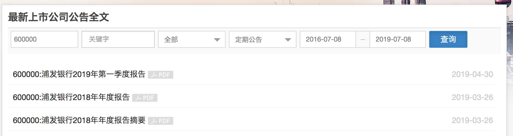
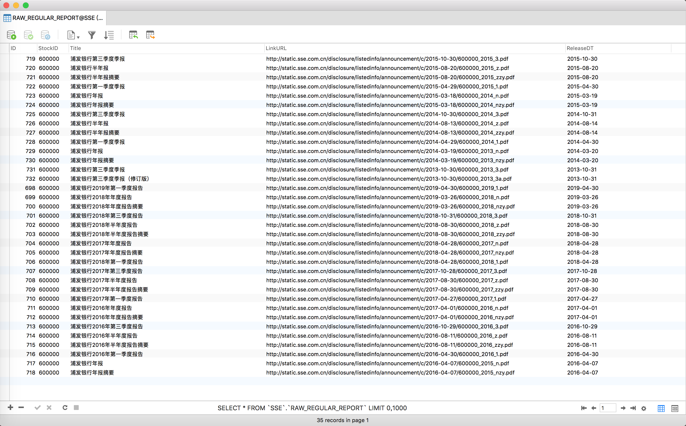

> 本文以一个简单的爬虫小例子为引子，整理一下使用scrapy编写爬虫、下载文件、渲染js页面等常规操作。
>
> 目标：爬取上交所公告页面中的某家上市公司定期报告（包括一季报、中报、三季报、年报及摘要）。
>
> 这是[完整版文档](https://doc.scrapy.org/en/latest/intro/tutorial.html)。

<!--more-->

## 安装Scrapy

```bash
$ pip install scrapy
```

## Scrapy架构图


1. Engine从Spiders获得需要爬取的Requests
2. Engine在Scheduler中给Requests排队
3. Scheduler把新的Requests丢给Engine
4. Engine把排队轮到的Requests丢给Downloader，中间经过Downloader Middleware的处理
5. 当Downloader完成下载，生成一个Response，经过Downloader Middleware的处理后丢还给Engine
6. Engine得到Response后，经过Spider Middleware的处理，丢还给Spiders，
7. Spiders处理Response后，会生成新的Requests和Items，经过Spider Middleware的处理，传送给Engine
8. Engine把Items送给Item Pipelines处理，同时把新的Requests丢给Scheduler排队
9. 循环重复，直到Scheduler没有剩余未处理的Requests

再站在各个组件的角度，解释一下功能：

**Scrapy Engine（引擎）**

- 这是引擎，负责Spiders、ItemPipeline、Downloader、Scheduler中间的通讯，信号、数据传递等等。

**Scheduler（调度器）**

- 它负责接受引擎发送过来的requests请求，并按照一定的方式进行整理排列，入队、并等待Scrapy Engine(引擎)来请求时，交给引擎。

**Downloader（下载器）**

- 负责下载Scrapy Engine(引擎)发送的所有Requests请求，并将其获取到的Responses交还给Scrapy Engine(引擎)，由引擎交给Spiders来处理。

**Spiders**

- 它负责处理所有Responses,从中分析提取数据，获取Item字段需要的数据，并将需要跟进的URL提交给引擎，再次进入Scheduler(调度器)。

**Item Pipeline**

- 它负责处理Spiders中获取到的Item，并进行处理，比如去重，持久化存储（存数据库，写入文件，总之就是保存数据用的）。

**Downloader Middlewares（下载中间件）**

- 你可以当作是一个可以自定义扩展下载功能的组件。

**Spider Middlewares（Spider中间件）**

- 你可以理解为是一个可以自定扩展和操作引擎和Spiders中间‘通信‘的功能组件（比如进入Spiders的Responses和从Spiders出去的Requests）。

## 新建爬虫项目

```bash
$ scrapy startproject sseDisclosure
```

给项目取名为`sseDisclosure`，会在目录下建立新的文件夹，并拥有完整的目录结构。

建立完目录后要做些什么？最基本的爬虫至少拥有以下几项内容：

- **第一件事情**是在`items.py`文件中定义一些字段，这些字段用来临时存储你需要保存的数据
- **第二件事情**在`spiders文件夹`中编写自己的爬虫
- **第三件事情**在`pipelines.py`中存储自己的数据
- **还有一件事情**，不是非做不可的，就`settings.py`文件 并不是一定要编辑的，只有有需要的时候才会编辑。

通常在`settings.py`中会做以下修改：

```python
# Obey robots.txt rules 
ROBOTSTXT_OBEY = False #关闭机器人访问限制

# Enable and configure HTTP caching (disabled by default)
# See https://doc.scrapy.org/en/latest/topics/downloader-middleware.html#httpcache-middleware-settings
HTTPCACHE_ENABLED = True
HTTPCACHE_EXPIRATION_SECS = 0
HTTPCACHE_DIR = 'httpcache'
HTTPCACHE_IGNORE_HTTP_CODES = []
HTTPCACHE_STORAGE = 'scrapy.extensions.httpcache.FilesystemCacheStorage'
```

这几行注释的作用是，Scrapy会缓存你有的Requests！当你再次请求时，如果存在缓存文档则返回缓存文档，而不是去网站请求，这样既加快了本地调试速度，也减轻了 网站的压力。

## 编写Item.py

简单地看下要爬取的[页面](http://www.sse.com.cn/disclosure/listedinfo/announcement/index.shtml?productId=600000)，选择`定期公告`，点击查询：



我们想要**存储信息**并**下载pdf**。

存储的信息需要事先在[Item](https://doc.scrapy.org/en/latest/topics/items.html)中声明，在`items.py`中加入：

```python
import scrapy
class SsedisclosureItemYearReport(scrapy.Item):
    pdf_title = scrapy.Field()
    pdf_fulltitle = scrapy.Field()
    pdf_date = scrapy.Field()
    pdf_url = scrapy.Field()
```

这里我们想要存储**公告名字**（源码中有两个来源，显示的文本与定义tag的属性）、**公告日期**、**文件地址**。

## 编写Spider

进入`spiders`目录下，新建一个文件`ssedis.py`（名字任意）。

由于我们想要爬取的页面是需要进行js渲染的，很难通过直接解析request的真实内容进行爬取。

这里我们采用`scrapy_splash`包，结合`splash`服务使用，关于splash的使用详见。

首先import需要的库：

```python
import scrapy
from scrapy_splash import SplashRequest
from sseDisclosure.items import SsedisclosureItemYearReport
```

第三行是我们刚刚写好的`item类`。

然后定义一个新的`spider类`，需要定义`name`、`start_requests`函数和`parse`函数。

其中`name`是在命令行中调用爬虫的名字，`start_requests`是用来生成起始requests，`parse`是requests的回调函数，用来处理返回的response。

可以手动定义一个请求头（header），从而更好地模拟正常浏览器的访问行为。

```python
# -*- coding: utf-8 -*-
import scrapy
from scrapy_splash import SplashRequest
from sseDisclosure.items import SsedisclosureItemYearReport

script = """
function main(splash, args)
  assert(splash:go(args.url))
  assert(splash:wait(5))
  local results = {}
  splash:runjs([[
    document.getElementsByClassName("ms-drop ms-bottom")[1].getElementsByTagName("label")[1].click()  //选择定期报告
    document.getElementsByClassName("btn btn-primary js_output_apphide")[0].click()   //提交
  ]])
  assert(splash:wait(5))
  results[0] = splash:html()

  splash:runjs([[
    document.getElementById("start_date").click()
    for (var i=0; i<35; i++){
        document.getElementsByClassName("icon-arrow-left")[0].click()
    }
    a = document.getElementsByClassName("datetimepicker-days")[0].getElementsByClassName("day")
    for (var i=0; i<a.length; i++){
        if (a[i].className == "day" && a[i].innerText == "16"){
            a[i].click()
            break
        }
    }
	]])
  assert(splash:wait(2))
  splash:runjs([[
    document.getElementById("end_date").click()
    for (var i=0; i<35; i++){
        document.getElementsByClassName("icon-arrow-left")[7].click()
    }
    a = document.getElementsByClassName("datetimepicker-days")[1].getElementsByClassName("day")
    for (var i=0; i<a.length; i++){
        if (a[i].className == "day" && a[i].innerText == "15"){
            a[i].click()
            break
        }
    }
    document.getElementsByClassName("btn btn-primary js_output_apphide")[0].click()
  ]])
  assert(splash:wait(5))
  results[1] =  splash:html()
  return results
end
"""

class SsedisSpider(scrapy.Spider):
    name = 'sse-report'
    header = {        
        'Host': 'www.sse.com.cn',
        'Connection': 'keep-alive',
        'Cache-Control': 'max-age=0',
        'Upgrade-Insecure-Requests': '1',
        'User-Agent': 'Mozilla/5.0 (Macintosh; Intel Mac OS X 10_13_6) AppleWebKit/537.36 (KHTML, like Gecko) Chrome/73.0.3683.86 Safari/537.36',
        'Accept': 'text/html,application/xhtml+xml,application/xml;q=0.9,image/webp,image/apng,*/*;q=0.8,application/signed-exchange;v=b3',
        'Accept-Encoding': 'gzip, deflate',
        'Accept-Language': 'zh-CN,zh;q=0.9,en;q=0.8',
    }

    def start_requests(self):
        urls = ['http://www.sse.com.cn/disclosure/listedinfo/announcement/index.shtml?productId=600000']
        for url in urls:
            yield SplashRequest(url = url, headers=self.header, callback=self.parse, endpoint='execute', args={'lua_source': script})

    def parse(self, response):
        pdf_ttl, pdf_fullttl, pdf_date, pdf_url = self.extractItem(response)
        for i in range(len(pdf_url)):
            list_pdf = SsedisclosureItemYearReport()
            list_pdf['pdf_title'] = pdf_ttl[i].replace('\\"', '').encode().decode("unicode-escape")
            list_pdf['pdf_fulltitle'] = pdf_fullttl[i].replace('\\"', '').encode().decode("unicode-escape")
            list_pdf['pdf_date'] = pdf_date[i].replace('\\"', '')
            list_pdf['pdf_url'] = pdf_url[i].replace('\\"', '')
            yield list_pdf
    
    def extractItem(self, response):
        pdf_title = response.xpath('''//em[@class='\\"pdf-first\\"']/a/@title''').extract()
        pdf_fulltitle = response.xpath('''//em[@class='\\"pdf-first\\"']/a/text()''').extract()
        pdf_date = response.xpath('''//dl[@class='\\"modal_pdf_list\\"']//span/text()''').extract()
        pdf_url = response.xpath('''//em[@class='\\"pdf-first\\"']/a/@href''').extract()
        return pdf_title, pdf_fulltitle, pdf_date, pdf_url


```

需要注意的两点：

1. start_requests函数中使用了SplashRequest，替代了默认的Request函数，是为了使用js渲染服务（关于SplashRequest的特殊用法可以查看[github源码说明](https://github.com/scrapy-plugins/scrapy-splash)）。
   简单地说，设置endpoint为`execute`，是为了让渲染服务执行自定义js脚本，从而完成模拟点击的行为，需要在args中指明`lua脚本`对应的内容。
2. list_pdf是我们编写的item类的一个实例。scrapy（确切地说是SplashRequest）返回的response可以直接调用xpath方法抽取内容，其他的抽取方法（如CSS）可以看官方的说明文档。从response中抽取内容填入对应字段，产生迭代对象即可。

**建议按单条记录生成item**，便于后续在pipeline进行去重操作。

## 编写pipelines.py

得到item后，还需要在item pipelines中做相应的去重、存储处理。

这里我们将数据存到本地的mysql数据库中：

```python
import scrapy
from sseDisclosure import settings
from sseDisclosure.items import SsedisclosureItemYearReport
from scrapy.exceptions import DropItem
import pymysql

MYSQL_HOSTS = settings.MYSQL_HOSTS
MYSQL_USER = settings.MYSQL_USER
MYSQL_PASSWORD = settings.MYSQL_PASSWORD
MYSQL_DB = settings.MYSQL_DB

class SsedisclosurePipeline(object):
    """
    插入数据库
    """
    def open_spider(self, spider):
        self.db = pymysql.connect(MYSQL_HOSTS, MYSQL_USER, MYSQL_PASSWORD, MYSQL_DB)
        self.cursor = self.db.cursor()

    def close_spider(self, spider):
        self.db.close()

    def process_item(self, item, spider):
        if isinstance(item, SsedisclosureItemYearReport): 
            sql = "INSERT INTO RAW_REGULAR_REPORT(StockID, Title, LinkURL, ReleaseDT) \
                   VALUES ('%s', '%s',  '%s',  '%s')" % \
                   (item['pdf_fulltitle'].split(':')[0], item['pdf_title'], item['pdf_url'], item['pdf_date'])
            try:
                self.cursor.execute(sql)
                self.db.commit()
            except:
                self.db.rollback()

class DuplicatesPipeline(object):
    """
    去重
    """
    def __init__(self):
        self.url_set = set()

    def process_item(self, item, spider):
        pdf_url = item['pdf_url']
        if pdf_url in self.url_set:
            raise DropItem("Duplicate pdf link found:%s" % item['pdf_fulltitle'])
        else:
            self.url_set.add(pdf_url)
            return item
```

通常我们将数据库连接的账号密码保存在`settings.py`中，从项目文件夹中`import settings`得到数据库连接信息。

在`SsedisclosurePipeline`中，我们主要需要改写`process_item`方法，判断item的原型（因为有时候会有多个item类，每个类的实例处理方法不同，需要加以区分），然后循环写入数据库。在`open_spider`打开数据库连接，并创建一个新游表，在`close_spider`关闭数据库连接。

去重操作比较简单，但是需要注意设置去重和存储这两个pipeline的优先次序。

## 修改settings.py

设置文件中，除了做最开始的几点改动，以及启动splash需要做的设置外，通常还需要增加以下内容：

```python
# 设置下载限制
DOWNLOAD_DELAY = 5
DOWNLOAD_TIMEOUT=1800
# 设置同时请求requests的数量，防止被ban ip
CONCURRENT_REQUESTS_PER_DOMAIN = 2
CONCURRENT_REQUESTS_PER_IP = 2
# 开启我们刚刚写好的pipelines，并设置优先级
ITEM_PIPELINES = {
    'sseDisclosure.pipelines.DuplicatesPipeline': 250,
    'sseDisclosure.pipelines.SsedisclosurePipeline': 300
}
# 设置日志输出等级
LOG_ENABLED = True
LOG_LEVEL = 'ERROR'
```

这里items需要经过多个pipelines的处理，优先通过`low value`的pipeline，后经过`high value`的pipeline，值的范围从`0-1000`。

日志输出等级控制终端显示的日志信息，共五种级别由低到高：

`DEBUG`、`INFO`、`WARNING`、`ERROR`、`CRITICAL`，级别越高信息越少。

## 运行爬虫

由于此次使用了splash，不要忘记先在docker中。

进入爬虫主目录下，在终端中运行：

```bash
$ scrapy crawl sse-report
```

由于设定了`LOG_LEVEL`为`ERROR`，在不报错的情况下是不会有日志显示的。

查看数据库中的结果：



下一篇将介绍如何下载文件。


