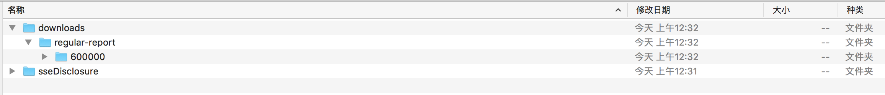
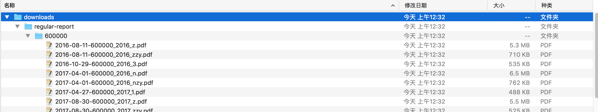

> 本篇主要基于，略作修改，增加下载文件的功能。
>
> 官方文档已经对[下载文件/图片](https://docs.scrapy.org/en/latest/topics/media-pipeline.html#)的方法做了完整的说明。

<!--more-->

## 修改setting

第一步，需要修改`setting.py`文件，指定一些下载文件需要说明的内容：

```bash
# 下载文件存放位置
FILES_STORE = '../downloads'
# items中用于存储下载链接的字段名
FILES_URLS_FIELD = 'pdf_url'
# 保留120天下载缓存
FILES_EXPIRES = 120
# 下载延迟
DOWNLOAD_DELAY = 5
DOWNLOAD_TIMEOUT = 180
# 同时请求的requests数量
CONCURRENT_REQUESTS_PER_DOMAIN = 2
CONCURRENT_REQUESTS_PER_IP = 2
```

`FILES_STORE`：指定下载文件的根目录，此处我们设置为爬虫项目文件夹同层的downloads文件夹。

`FILES_URLS_FIELD`：指定item中用于下载文件的url，我们将pdf链接地址保存在`pdf_url`字段中。

`FILES_EXPIRES`：下载文件缓存，120天内下载过的链接，使用缓存而不是重新下载，减轻服务器压力。

`DOWNLOAD_DELAY`、`DOWNLOAD_TIMEOUT`：下载延迟设置

`CONCURRENT_REQUESTS_PER_DOMAIN`、`CONCURRENT_REQUESTS_PER_IP`：限制domain/ip同时请求的数量，防止被ban。

## 修改Item定义

需要新增一个字段，用于保存下载的内容信息。根据官方文档规定，默认保存下载文件信息的字段名为`files`，修改后的item定义如下：

```python
class SsedisclosureItemYearReport(scrapy.Item):
    pdf_title = scrapy.Field()
    pdf_fulltitle = scrapy.Field()
    pdf_date = scrapy.Field()
    pdf_url = scrapy.Field() # 存放下载链接
    files = scrapy.Field() # 存放文件内容
```

## 新增下载文件pipeline

我们既可以默认使用自带的文件管道类`FilesPipeline`，也可以通过继承父类来生成自己的管道。

如果使用默认类和方法，只需要在setting中开启`scrapy.pipelines.files.FilesPipeline'`管道就可以了，但是无法设置下载文件的文件名，系统会默认使用下载链接的SHA1哈希码作为文件名（就是一串乱码）。

我们想自定义文件名和子目录，继承父类后复写以下两个方法：

```python
class SsedisclosureFilesPipeline(FilesPipeline):
    def get_media_requests(self, item, info):
        if isinstance(item, SsedisclosureItemYearReport):
            yield Request(item.get(self.files_urls_field, []), meta=item)

    def file_path(self, request, response=None, info=None):
        stockid = request.meta['pdf_fulltitle'].split(':')[0]
        name = request.meta['pdf_url'].split('/')[-1]
        dt = request.meta['pdf_date']
        return '/regular-report/%s/%s-%s' % (stockid, dt, name)
```

`get_media_requests`：用于生成下载文件的链接，当items比较多时，我们只需要判断item是否是我们需要下载的那个，然后取出`files_urls_field`字段，这个默认值在setting中设定。此外，由于我们需要根据item的内容设定文件名，所以通过meta把item传递下去。

`file_path`：生成我们想要的子目录和文件名，此处我们在下载文件夹中增加`regular-report`和股票代码子文件夹，最后用`公告日期-文件名`的形式存储pdf。

## 修改pipeline顺序

最后，修改setting中pipeline的顺序，让item排队通过：

```python
ITEM_PIPELINES = {
    'sseDisclosure.pipelines.DuplicatesPipeline': 250,
    'sseDisclosure.pipelines.SsedisclosureFilesPipeline': 280, # 使用自定义的文件下载管道
    # 'scrapy.pipelines.files.FilesPipeline': 1 # 使用默认的文件下载管道
    'sseDisclosure.pipelines.SsedisclosurePipeline': 300,
}
```

我们设定的顺序是：去重 - 下载pdf文件 - 其他信息存入数据库。

如果不自己编写`FilesPipeline`，可以直接使用scrapy自带的文件下载管道`scrapy.pipelines.files.FilesPipeline`，开启就行了。

## 测试下载爬虫

最后测试一下下载效果：

```bash
$ scrapy crawl sse-report
```






修改spider中的lua脚本，改成迭代爬取所有股票、所有历史上公布的年报，就可以爬取全量报告了！