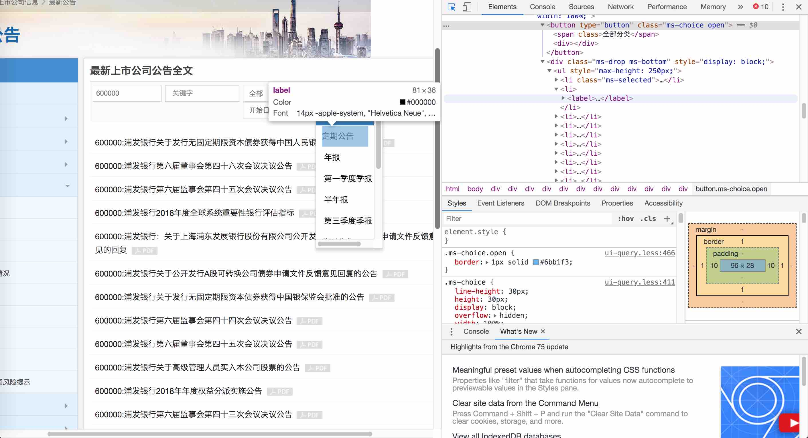
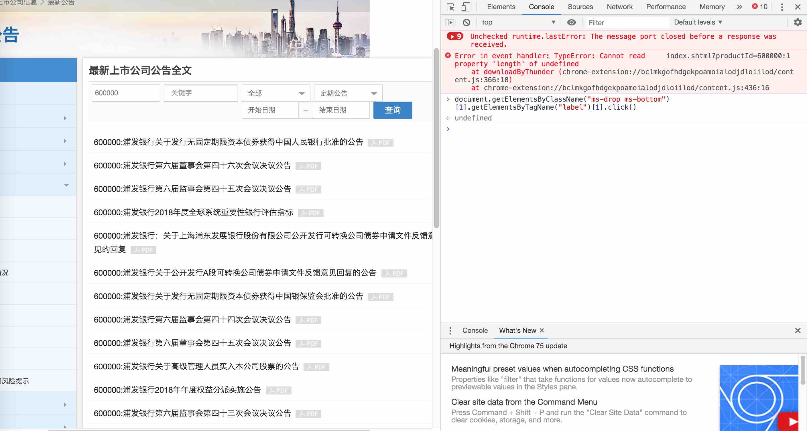
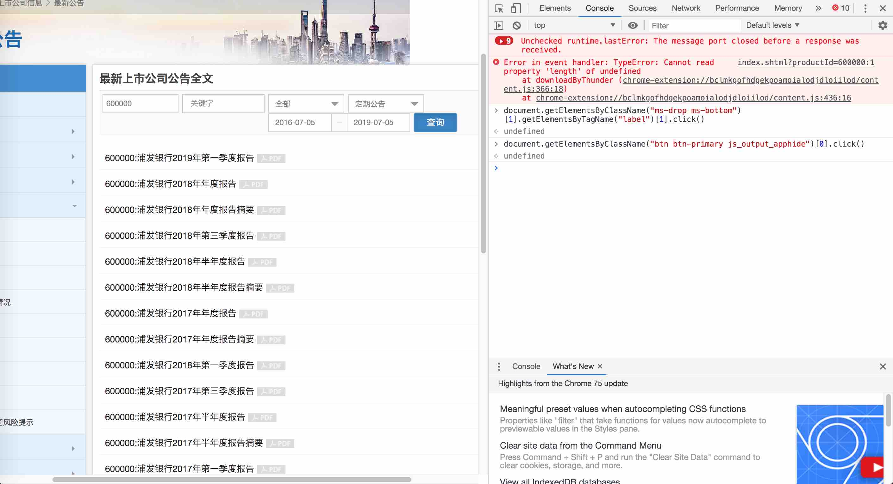
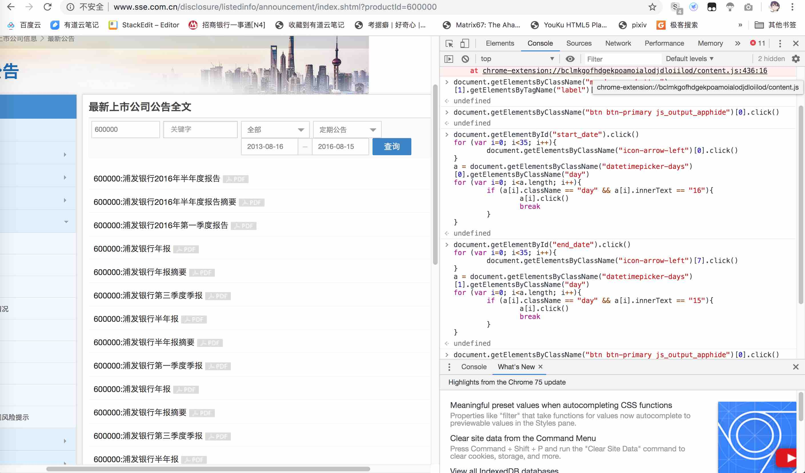
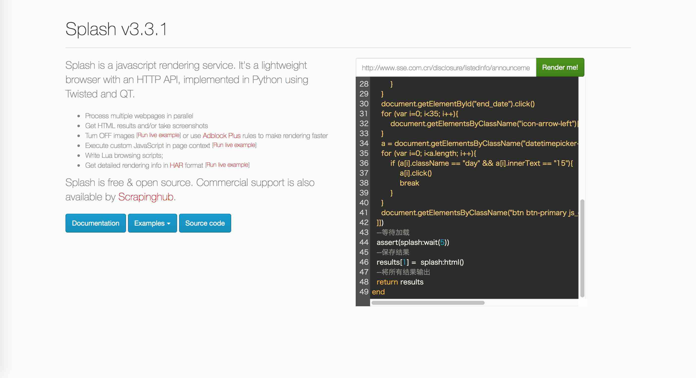
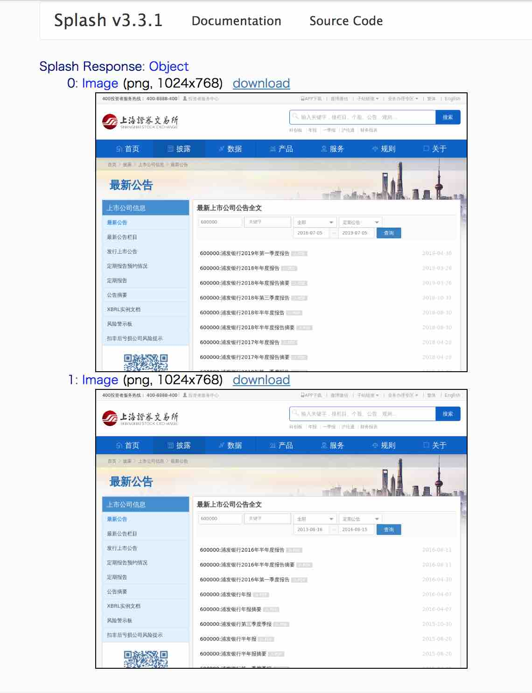
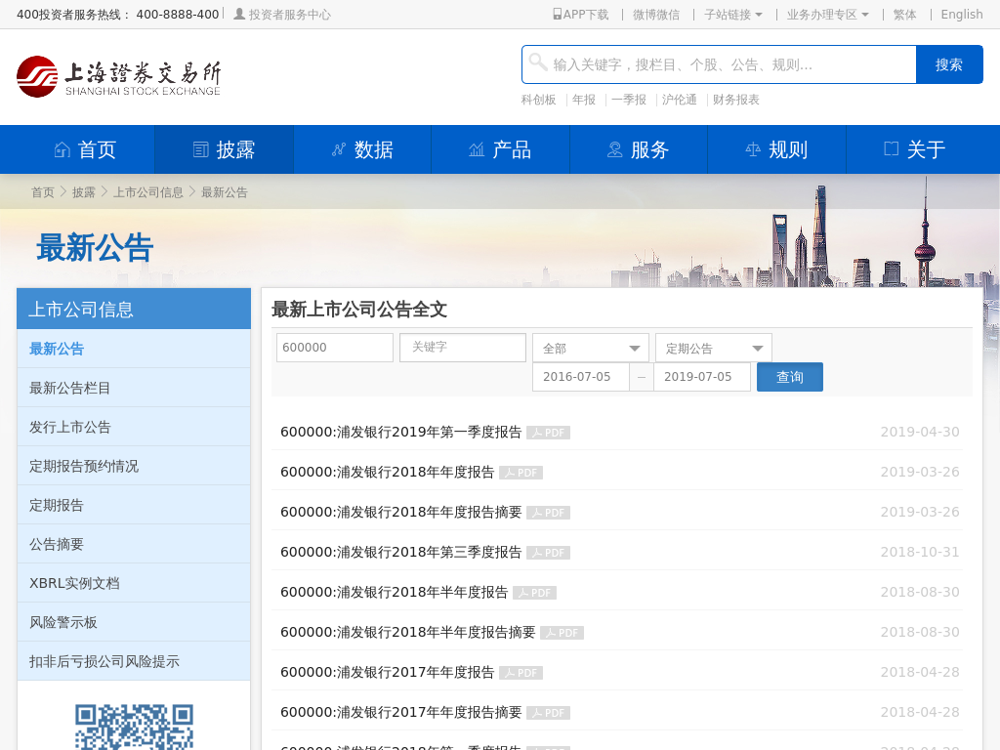
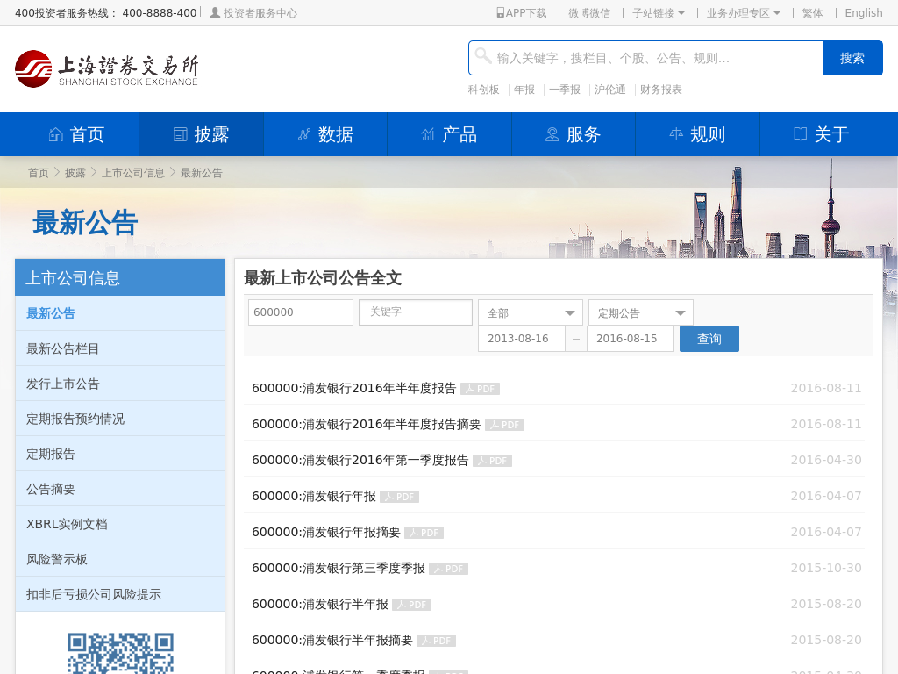

爬虫过程中经常需要处理`js动态加载`的页面，通常的处理方式有两种：一种是使用**Selenium**调用浏览器渲染页面，另一种是使用**Splash**进行渲染。Splash更轻量级，经常配合Scrapy使用，本文介绍其安装与使用方法。

<!--more-->

## 安装Splash

1. 安装[Docker](http://docker.io/)。

2. 下载镜像：

   ```bash
   $ sudo docker pull scrapinghub/splash
   ```

3. 启动容器：

   ```bash
   $ sudo docker run -it -p 8050:8050 scrapinghub/splash
   ```

4. 访问http://localhost:8050 即可使用splash。

## 使用Splash Jupyter

1. 下载镜像：

   ```bash
   $ docker pull scrapinghub/splash-jupyter
   ```

2. 启动容器：

   ```bash
   $ docker run -p 8888:8888 -it scrapinghub/splash-jupyter
   ```

3. 访问http://localhost:8888 即可使用splash jupyter。

为了避免和本机的`jupyterlab`冲突，建议修改本机的jupyterlab监听端口。

## 写Splash脚本

启动完成后，主要通过`Chrome`和`8050`端口上的服务，来验证**lua脚本**的正确性。

### 举个例子

我们想获取`600000浦发银行`在上交所公布的年报下载地址，但是披露页主要通过js进行渲染与切换，并且很难通过解析js脚本中的请求信息来获取真实的下载地址。让我们看看如何使用splash来操作页面并得到渲染后的页面吧~

进入想要爬取的[起始页面](http://www.sse.com.cn/disclosure/listedinfo/announcement/index.shtml?productId=600000)。

对于`全部分类`，我们想选择`定期报告`，通过`Chrome`的开发者工具，找到选择框的按钮定义：



选择该按钮并点击，js脚本如下：

```javascript
document.getElementsByClassName("ms-drop ms-bottom")[1].getElementsByTagName("label")[1].click() 
```

可以在`Console`运行脚本，直接得到点击后的结果：



同样的方式，找到并点击`查询`按钮：

```javascript
document.getElementsByClassName("btn btn-primary js_output_apphide")[0].click() 
```

此时可以看到，左侧已经是我们想要的页面，返回源码就可以进行解析：



由于网站限制，只能选择最近三年的公告，我们希望时间窗口再往前推三年，需要对开始时间、结束时间分别选择。

**处理开始时间**：找到开始时间的窗口，时间往回推35个月，并选择第16日：

```javascript
document.getElementById("start_date").click()
for (var i=0; i<35; i++){
		document.getElementsByClassName("icon-arrow-left")[0].click()
}
a = document.getElementsByClassName("datetimepicker-days")[0].getElementsByClassName("day")
for (var i=0; i<a.length; i++){
		if (a[i].className == "day" && a[i].innerText == "16"){
				a[i].click()
				break
		}
}
```

**处理结束时间**：找到结束时间的窗口，时间往回推35个月，并选择第15日（满足时间窗口小于三年）：

```javascript
document.getElementById("end_date").click()
for (var i=0; i<35; i++){
		document.getElementsByClassName("icon-arrow-left")[7].click()
}
a = document.getElementsByClassName("datetimepicker-days")[1].getElementsByClassName("day")
for (var i=0; i<a.length; i++){
		if (a[i].className == "day" && a[i].innerText == "15"){
				a[i].click()
				break
		}
}
```

**再次点击`提交`按钮**，我们可以得到新的时间窗口下返回的页面：

```javascript
document.getElementsByClassName("btn btn-primary js_output_apphide")[0].click()
```



最后，整合成`lua脚本`，在splash服务中进行验证，脚本如下：

```lua
function main(splash, args)
  --进入起始页面
  assert(splash:go(args.url))
  --等待加载
  assert(splash:wait(3))
  --创建字典，保存返回结果
  local results = {}
  --选择定期报告，并点击查询按钮
  splash:runjs([[
    document.getElementsByClassName("ms-drop ms-bottom")[1].getElementsByTagName("label")[1].click()  
    document.getElementsByClassName("btn btn-primary js_output_apphide")[0].click()  
  ]])
  assert(splash:wait(3))
  --保存返回结果
  results[0] = splash:png()
  --时间窗口往前移35个月，并重新查询
  splash:runjs([[
    document.getElementById("start_date").click()
    await sleep(1000);
    for (var i=0; i<35; i++){
        document.getElementsByClassName("icon-arrow-left")[0].click()
    }
    a = document.getElementsByClassName("datetimepicker-days")[0].getElementsByClassName("day")
    for (var i=0; i<a.length; i++){
        if (a[i].className == "day" && a[i].innerText == "16"){
            a[i].click()
            break
        }
    }
    document.getElementById("end_date").click()
    await sleep(1000);
    for (var i=0; i<35; i++){
        document.getElementsByClassName("icon-arrow-left")[7].click()
    }
    a = document.getElementsByClassName("datetimepicker-days")[1].getElementsByClassName("day")
    for (var i=0; i<a.length; i++){
        if (a[i].className == "day" && a[i].innerText == "15"){
            a[i].click()
            break
        }
    }
    document.getElementsByClassName("btn btn-primary js_output_apphide")[0].click()
  ]])
  --等待加载
  assert(splash:wait(3))
  --保存结果
  results[1] =  splash:png()
  --将所有结果输出
  return results
end
```

此处为了验证返回结果的正确性，我们先让splash返回截图（png），若要返回源码，只需要将`splash:png()`改为`splash:html()`就可以了。

在splash的页面中填入初始地址与脚本，点击`Render me!`：



可以得到两张截图：







## 使用scrapy-splash

### 安装配置

搞定了js渲染后，如何与scrapy结合？简单整理下用法及注意点。

根据[官方文档](https://github.com/scrapy-plugins/scrapy-splash)，先安装`scrapy-splash`包，然后在scrapy的项目文件中配置`settings.py`文件：

- 添加Splash服务的地址：

```python
SPLASH_URL = 'http://192.168.59.103:8050'
```

- 启用Splash下载中间件，在`DOWNLOADER_MIDDLEWARES`中更改`HttpCompressionMiddleware`的优先级：

```python
DOWNLOADER_MIDDLEWARES = {
  'scrapy_splash.SplashCookiesMiddleware': 723,
  'scrapy_splash.SplashMiddleware': 725,
  'scrapy.downloadermiddlewares.httpcompression.HttpCompressionMiddleware': 810,
}
```

- 启用`SplashDeduplicateArgsMiddleware`：

```python
SPIDER_MIDDLEWARES = {
    'scrapy_splash.SplashDeduplicateArgsMiddleware': 100,
}
```

- 启用`DUPEFILTER_CLASS`：

```python
DUPEFILTER_CLASS = 'scrapy_splash.SplashAwareDupeFilter'
```

- 如果使用Scrapy HTTP cache，则需要对scrapy splash进行相应配置：

```python
HTTPCACHE_STORAGE = 'scrapy_splash.SplashAwareFSCacheStorage'
```

其他更多配置详见官方文档。

具体如何结合scrapy使用，详见这篇[scrapy教程](scrapy-tut.md)。

## Docker基本命令

启动容器：

```bash
$ docker run -i -t <image_name/continar_id> /bin/bash
```

查看运行容器：

```bash
$ docker ps
$ docker ps -a  
$ docker ps | less -S
```

删除容器：

```bash
$ docker rm Name/ID 
```

停止、启动、杀死、重启一个容器：

```bash
$ docker stop Name/ID  
$ docker start Name/ID  
$ docker kill Name/ID  
$ docker restart name/ID
```

查看容器日志：

```bash
$ docker logs <id/container_name>
```

PS：每次`run`过一个镜像（image）后会生成一个容器（container），容器启动用`start`，如果再次使用`run`，则会生成多个重复的容器。

PPS：在容器中运行jupyter时，会在日志中产生token，需要通过查看日志的命令获取。


